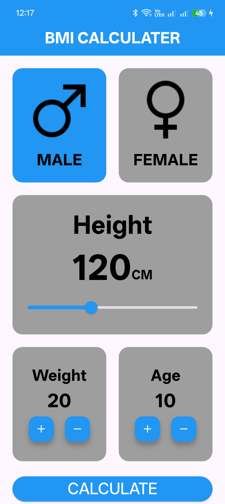
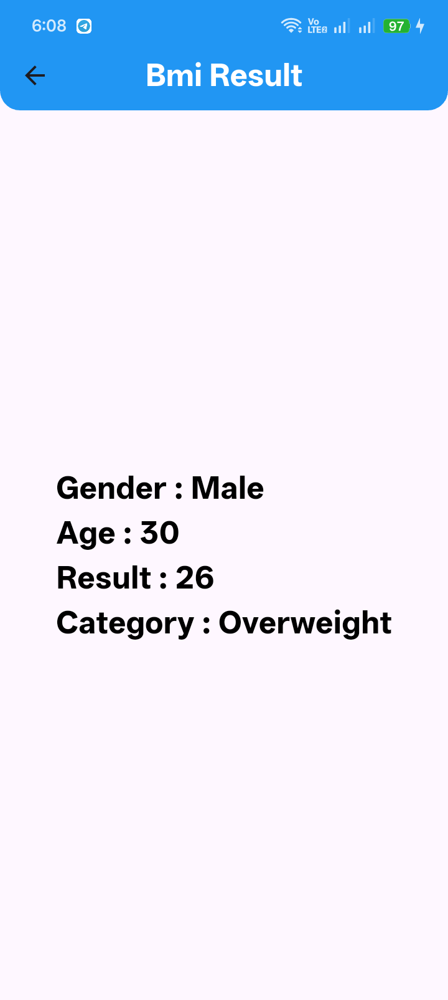

# ⚖️ BMI Calculator App


A simple and interactive **BMI (Body Mass Index) Calculator** mobile application built with **Flutter**.

This project was created to practice building a stateful and interactive Flutter application with multiple user inputs, reusable custom widgets, screen navigation, and BMI calculation with health category classification.

---

## 🎯 Project Objectives

The main objectives of this project were to practice:

* Using `StatefulWidget` and `setState()`
* Managing multiple pieces of dynamic state
* Handling user input through sliders and counters
* Building reusable custom widgets
* Navigating between screens using `Navigator`
* Passing data between screens through widget constructors
* Using `Row`, `Column`, and `Expanded` to build flexible layouts
* Performing calculations based on user input
* Applying conditional logic to classify BMI results
* Organizing Flutter code into separate components

---

## ✨ Features

* 🚹 **Gender Selection**

  * Male / Female selection
  * Visual indication for the selected gender

* 📏 **Height Selection**

  * Interactive slider for selecting height

* 🎂 **Age Counter**

  * Increase or decrease age using buttons

* ⚖️ **Weight Counter**

  * Increase or decrease weight using buttons

* 🧮 **BMI Calculation**

  * Calculates BMI based on the selected height and weight

* 📊 **Results Screen**

  * Displays:

    * Gender
    * Age
    * BMI result
    * BMI category

* 🏷️ **BMI Classification**

  * Underweight
  * Normal
  * Overweight
  * Obese

* 📱 **Responsive UI**

  * Simple and clean mobile interface

---

## 🛠️ Technologies Used

* **Flutter**
* **Dart**
* **Material Design**

### Flutter Widgets Used

* `MaterialApp`
* `Scaffold`
* `AppBar`
* `StatefulWidget`
* `StatelessWidget`
* `Column`
* `Row`
* `Expanded`
* `Container`
* `Slider`
* `InkWell`
* `FloatingActionButton`
* `ElevatedButton`
* `SizedBox`
* `Image`
* `AssetImage`

### Other Concepts

* `setState()` for managing local state
* `Navigator.push()` for screen navigation
* `MaterialPageRoute` for routing
* Widget constructors for passing data
* Reusable custom components
* Conditional rendering and styling
* BMI calculation
* BMI category classification

---

## 📐 BMI Formula

The BMI is calculated using the standard formula:

```text
BMI = Weight (kg) / Height² (m)
```

### BMI Categories

| BMI Range   | Category    |
| ----------- | ----------- |
| Below 18.5  | Underweight |
| 18.5 – 24.9 | Normal      |
| 25 – 29.9   | Overweight  |
| 30 or above | Obese       |

> **Note:** This application is intended for educational and practice purposes and should not be used as a medical diagnosis tool.

---

## 📱 App Preview

### 🏠 Home Screen

<p align="center">
  
</p>

### 📊 Result Screen

<p align="center">
  
</p>

---

## 📂 Project Structure

```text
bmi_calculater/
│
├── lib/
│   ├── main.dart
│   │
│   ├── modules/
│   │   ├── home_view.dart
│   │   └── bmi_result.dart
│   │
│   └── shared/
│       └── component/
│           └── component/
│               ├── item1.dart
│               ├── item2.dart
│               ├── style_button.dart
│               └── style_font.dart
│
├── assets/
│   └── images/
│       ├── male.png
│       ├── female.png
│       ├── Screenshot_Home_Screen.png
│       └── Screenshot_Result.png
│
├── pubspec.yaml
└── README.md
```

---

## 🧩 Reusable Components

One of the main goals of this project was practicing **reusable widgets** instead of writing the same UI code repeatedly.

### `Item1`

Used for displaying the gender selection cards.

It receives:

* `color`
* `text`
* `image`
* `onTap`

This makes the component reusable for both Male and Female selections.

### `Item2`

Used for the Age and Weight counters.

It receives:

* `text`
* `stylePoint`
* `addPoint`
* `removePoint`

This allows the same component to handle different counter values.

### `StyleButton`

A reusable button component used to maintain consistent button styling throughout the application.

### `StyleFont`

A reusable text component that provides customizable:

* Text
* Font size
* Font weight
* Color
* Text baseline

---

## 🧠 What I Learned

Building this project helped me strengthen my understanding of Flutter fundamentals and interactive UI development.

Through this project, I practiced:

* Managing multiple independent pieces of state
* Using `setState()` to update the UI
* Building a gender selection interface
* Using conditional styling based on the selected gender
* Using `Slider` for numeric input
* Creating increment/decrement counters
* Reusing widgets through constructors and callbacks
* Passing data between screens
* Performing calculations from user input
* Creating conditional BMI categories
* Structuring a Flutter project into modules and reusable components

---

## 🚀 Getting Started

### Prerequisites

Before running this project, make sure you have:

* [Flutter SDK](https://docs.flutter.dev/get-started/install)
* Android Studio or Visual Studio Code
* Flutter and Dart extensions
* An Android emulator or physical Android device

Check your Flutter installation with:

```bash
flutter doctor
```

---

### Installation

#### 1. Clone the repository

```bash
git clone https://github.com/youssefmohamedflutter/bmi_calculater.git
```

#### 2. Navigate to the project directory

```bash
cd bmi_calculater
```

#### 3. Install dependencies

```bash
flutter pub get
```

#### 4. Run the application

```bash
flutter run
```

---

## 👨‍💻 Author

**Youssef Mohamed**

Flutter Developer

* 💼 LinkedIn: [youssef-gado](https://www.linkedin.com/in/youssef-gado-7a2891423/)
* 💻 GitHub: [youssefmohamedflutter](https://github.com/youssefmohamedflutter)

---

## ⭐ Support

If you found this project useful or interesting, consider giving the repository a ⭐ **Star** on GitHub.

---

## 📄 License

This project is licensed under the **MIT License**.
